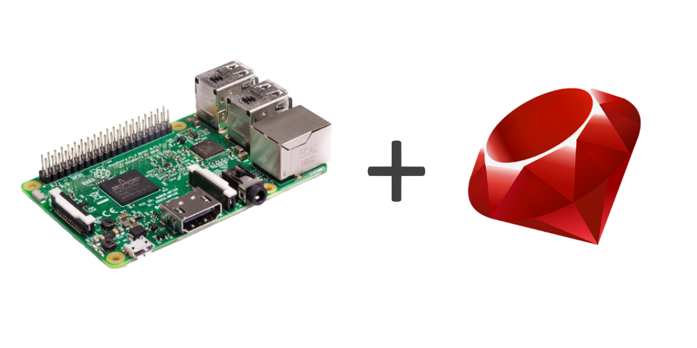

<div align="center">
  
  <h1>raspi-gpio-rb</h1>
  <h3>🔌 A simple and light interface to interact with GPIO pins of the Raspberry Pi.</h3>
</div>

This library uses /sys/class/gpio interface to communicate with GPIO pins. It doesn't require super-user rights, therefore everyone on the OS can use it.

- [📌 Requirements](#-requirements)
- [🔧 Setup](#-setup)
  - [Quick installation](#quick-installation)
  - [Gemfile](#gemfile)
  - [Build](#build)
- [⌨ Basic interactions](#-basic-interactions)
  - [Defining a pin](#defining-a-pin)
  - [Reading pin's value](#reading-pins-value)
  - [Outputing a value](#outputing-a-value)
  - [Cleanup pin](#cleanup-pin)
- [🔐 License](#-license)

## 📌 Requirements

This library requires an updated version of Ruby, and a Raspberry Pi with Raspbian installed on.

The raspi-gpio library has been tested on models : 3B

## 🔧 Setup

### Gemfile

If you setup the library for medium or big projects, it's recommended to write it in your Gemfile.

```gemfile
gem 'raspi-gpio', github: 'sergio1990/raspi-gpio-rb'
```

After, use again the `install` command, but without the package name.

```bash
gem install
```

### Build

You can also compile it by yourself. First, clone the repository.

```bash
git clone https://github.com/sergio1990/raspi-gpio-rb.git  # HTTP
          git@github.com:sergio1990/raspi-gpio-rb.git      # SSH
```

Then, build the gemspec file to create the gem.

```bash
gem build ./raspi-gpio.gemspec
```

Finally, install it on your system.

```bash
gem install ./raspi-gpio-1.x.x.gem
```

## ⌨ Basic interactions

First of all, we must include the library in our project. That can be achieved really easily with the `require` keyword.

```ruby
require 'raspi-gpio'

# ...
```

### Defining a pin

A GPIO pin is defined with three things :

- a pin number (the number of total pins depend on your Raspberry model)
- a direction (in or out)
- a value (low or high)

The `GPIO` class is the way the library provides to register our pins. The initialization method takes 2 arguments :

- the pin number to use
- the direction (default : out)

We can use the `OUT` and `IN` constants for the direction.

```ruby
pin = GPIO.new(9, GPIO::OUT)
```

The direction of a pin can be changed at any point of the code using the `mode` property.

```ruby
pin.mode = GPIO::IN
```

### Reading pin's value

To read the pin value, we're going to use the `value` property.

```ruby
pin.value

# Example output : 0
```

- If the pin direction is `IN`, it'll read the power that goes into it
- If it's in `OUT`, it'll output the value that we defined earlier

### Outputing a value

To set the value of a pin, the GPIO class has a `value` property that can take two values :

- 0, no power (low)
- 1, maximum power (high)

The `LOW` and `HIGH` constants are here to let us set them while keeping code clarity.

```ruby
# Imagine that a LED is connected to our pin.

pin.value = GPIO::HIGH

# Output : the LED is on

pin.value = GPIO::LOW

# Output : the LED is off
```

### Cleanup pin

It a good practice to unexport the pin once you're done working with it. For
this, just call a `cleanup` method on the pin's instance:

```ruby
pin.cleanup
```

## 🔐 License

See the [license file](LICENSE).
